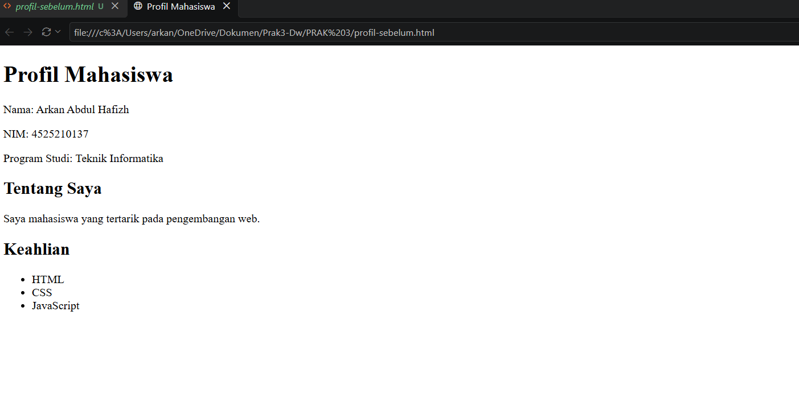
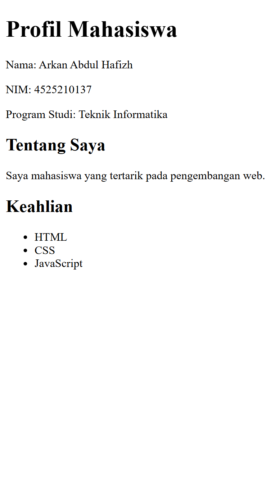
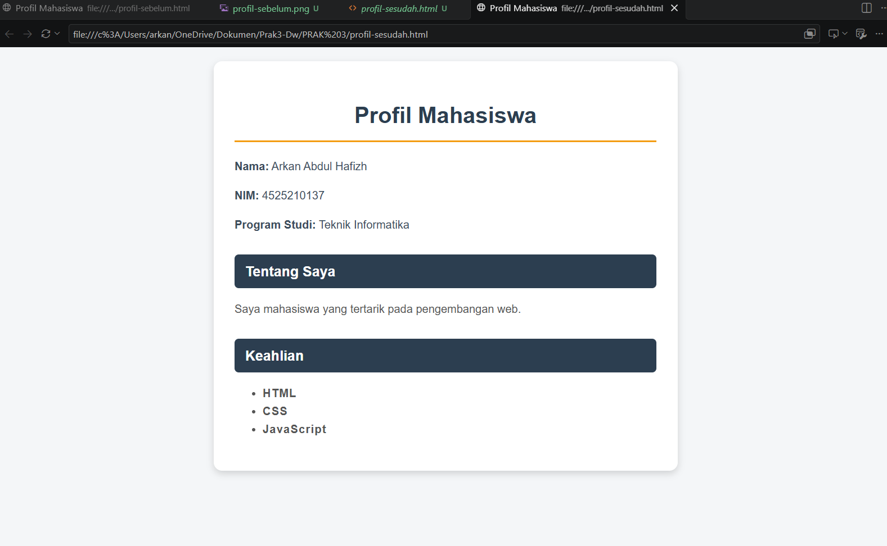
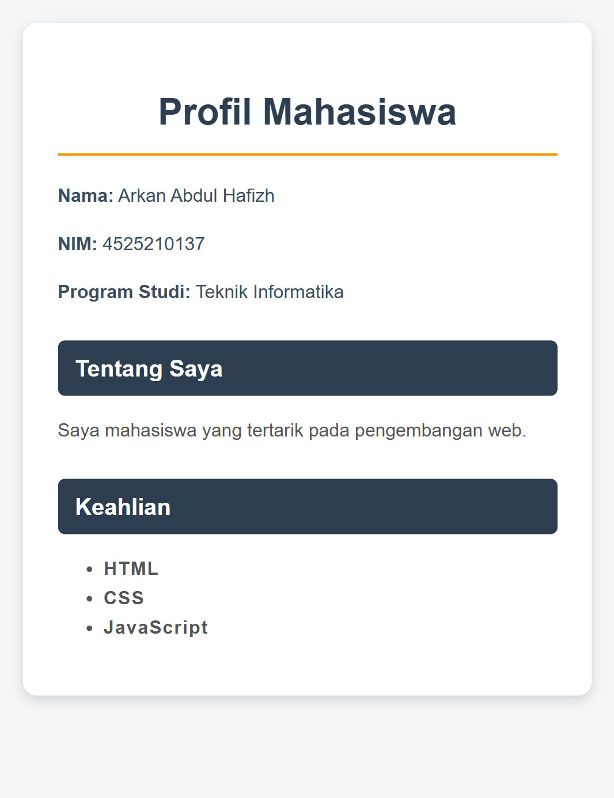

# Tugas Praktikum: Modifikasi Profil Mahasiswa dengan CSS Inline

**Nama:** Arkan Abdul Hafizh
**NPM:** 4525210137
**Program Studi:** Teknik Informatika
**Pertemuan:** 3

## Deskripsi

Memodifikasi halaman Profil Mahasiswa menggunakan **CSS Inline** (atribut `style` pada tag HTML) tanpa file CSS terpisah.

## Struktur Folder

- `profil-sebelum.html` : versi tanpa styling
- `profil-sesudah.html` : versi dengan CSS inline
- `images/` : screenshot sebelum dan sesudah

## Property CSS yang Digunakan (14)

`font-family`, `font-size`, `font-weight`, `text-align`, `letter-spacing`, `line-height`, `color`, `background-color`, `margin`, `padding`, `border-bottom`, `border-radius`, `box-shadow`, `max-width`

## Format Warna yang Digunakan (5)

| Format | Contoh |
|--------|--------|
| Nama warna | `white` |
| HEX | `#2c3e50` |
| RGB | `rgb(243, 156, 18)` |
| RGBA | `rgba(0, 0, 0, 0.15)` |
| HSL | `hsl(210, 20%, 30%)` |

## Hasil Sebelum

| Desktop | Mobile |
|---------|--------|
|  |  |

## Hasil Sesudah

| Desktop | Mobile |
|---------|--------|
|  |  |

## Penjelasan Perubahan

| Elemen | Perubahan | Tujuan |
|--------|-----------|--------|
| `<body>` | Latar abu muda, font Arial | Tampilan lebih bersih |
| `
` | Kartu putih, bayangan, sudut membulat | Konten terpusat dan menonjol |
| `<h1>` | Warna, rata tengah, garis bawah | Penekanan judul |
| `<h2>` | Latar gelap, teks putih | Pemisah antar bagian |
| `<ul>` | Teks tebal, spasi huruf | Lebih mudah dibaca |

## Masalah dan Solusi

| Masalah | Solusi |
|---------|--------|
| Style harus diulang di tiap tag | Salin-tempel manual (keterbatasan CSS inline) |
| Tidak bisa hover dan media query | Pakai `max-width` dan `margin: 0 auto` |
| Kode HTML jadi panjang | Tulis tiap property di baris terpisah |

## Kesimpulan

CSS inline cepat dan praktis untuk perubahan kecil, tetapi tidak bisa dipakai ulang, tidak mendukung hover dan media query, serta sulit dirawat. Untuk proyek besar lebih baik memakai CSS eksternal.
=======

